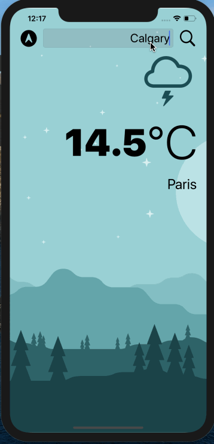
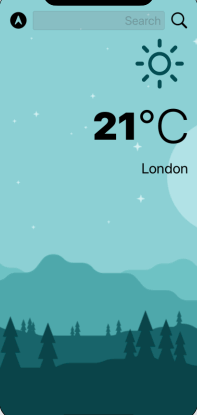

# Weather Mobile Application
An iOS mobile application that gets live data to check weather on current location based on GPS data or by searching a city manually
A project from Angela Yu's Swift course in Udemy

## Take A Peak

</img>

### Dark Mode

</img>

## Built With

* LANGUAGE: Swift
* API: OpenWeatherMap

## Author

* **Louise Acosta** 

## Acknowledgments

* A project from Angela Yu's Swift course in Udemy
